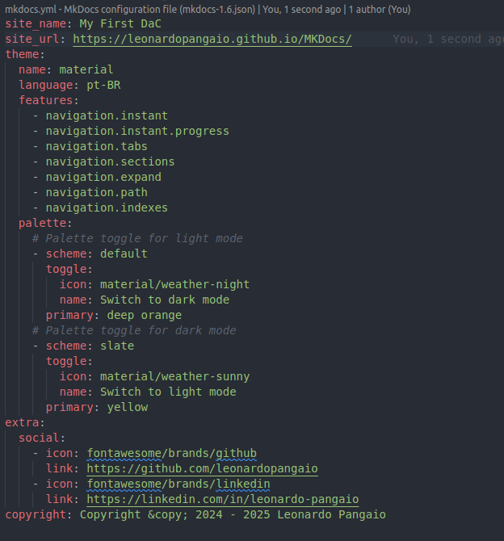

# New Page

For full documentation visit [mkdocs.org](https://www.mkdocs.org).

## Commands

* `mkdocs new [dir-name]` - Create a new project.
* `mkdocs serve` - Start the live-reloading docs server.
* `mkdocs build` - Build the documentation site.
* `mkdocs -h` - Print help message and exit.

<!--  -->

Teste de snippet baseado em um script externo.

```py title="Teste de snippet externo"
--8<-- "docs/teste.py"
```

```py title="Teste de snippet manual"
from datetime import datetime

print(f'{datetime.now()} - INFO - Olá mundo.')
```

```py title="Teste de snippet misto"
from datetime import datetime

print(f'{datetime.now()} - INFO - Olá mundo.')


--8<-- "docs/teste.py"
```

```yml title="Teste de snippet via url"
--8<-- "https://raw.githubusercontent.com/leonardopangaio/MKDocs/refs/heads/main/.github/workflows/ci.yml"
```


## Project layout

    mkdocs.yml    # The configuration file.
    docs/
        index.md  # The documentation homepage.
        ...       # Other markdown pages, images and other files.
